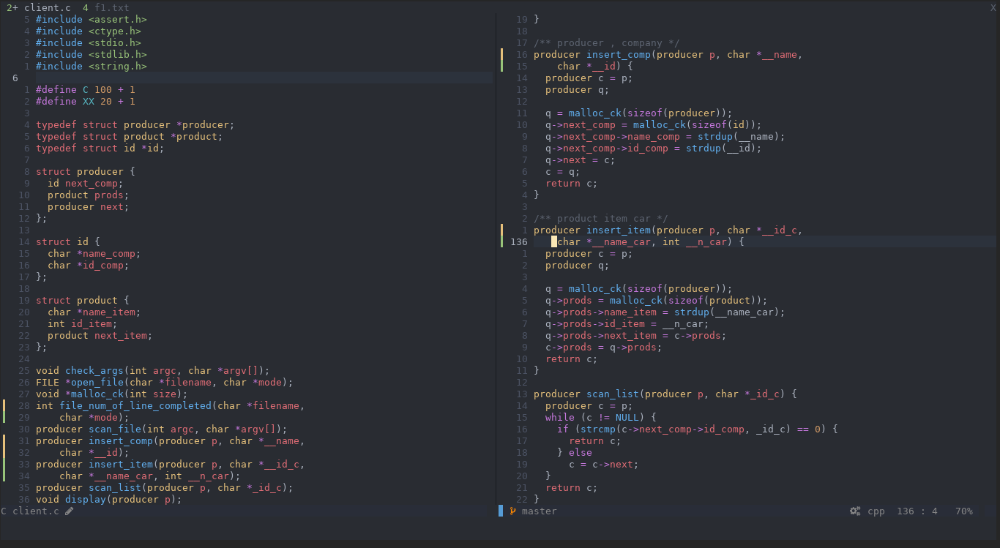

# nvim



## Installation

> Use it at your own risk, I've never tested it

```
wget https://raw.githubusercontent.com/frr0/nvim/master/install.sh && chmod +x install.sh && ./install.sh
```

## Configuration

> Note! this part could be partially useless since the installation script does the jobs for you, just take a look to Coc and Vimspector if you neet to

### [VIM-PLUG](https://github.com/junegunn/vim-plug)

neovim

```
sh -c 'curl -fLo "${XDG_DATA_HOME:-$HOME/.local/share}"/nvim/site/autoload/plug.vim --create-dirs \
       https://raw.githubusercontent.com/junegunn/vim-plug/master/plug.vim'
```

vim

```
curl -fLo ~/.vim/autoload/plug.vim --create-dirs \
    https://raw.githubusercontent.com/junegunn/vim-plug/master/plug.vim
```
-------------------------------------------

### [COC-VIM](https://github.com/neoclide/coc.nvim)

```
:CocInstall coc-json coc-tsserver coc-clangd coc-python coc-java
```

#### [Coc-snippets](https://github.com/neoclide/coc-snippets)

```
:CocInstall coc-snippets
```

#### [Util-snippets](https://github.com/sirver/UltiSnips)

#### [COC Extensions](https://github.com/neoclide/coc.nvim/wiki/Using-coc-extensions)

#### [COC sources](https://github.com/neoclide/coc-sources)

--------------------------------------------------------------------------------------------------------

### [Vimspector](https://github.com/puremourning/vimspector#supported-languages)

```
:VimspectorInstall vscode-cpptools 
:VimspectorInstall vscode-java-debug 
:VimspectorInstall debugpy
```

--------------------------------------------------------------------------------------------------------

### [Dev-Icons](https://github.com/ryanoasis/vim-devicons)

[Nerd fonts](https://github.com/ryanoasis/nerd-fonts#font-installation)

```
mkdir -p ~/.local/share/fonts
cd ~/.local/share/fonts && curl -fLo "Droid Sans Mono for Powerline Nerd Font Complete.otf" https://github.com/ryanoasis/nerd-fonts/raw/master/patched-fonts/DroidSansMono/complete/Droid%20Sans%20Mono%20Nerd%20Font%20Complete.otf
```
